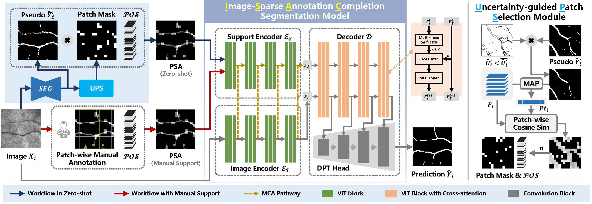
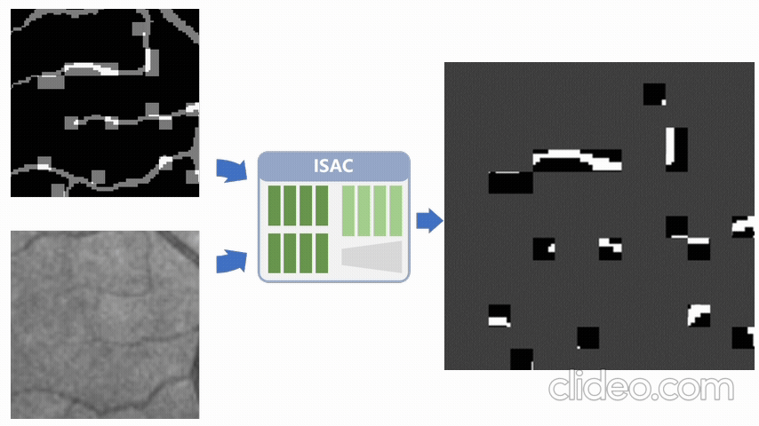
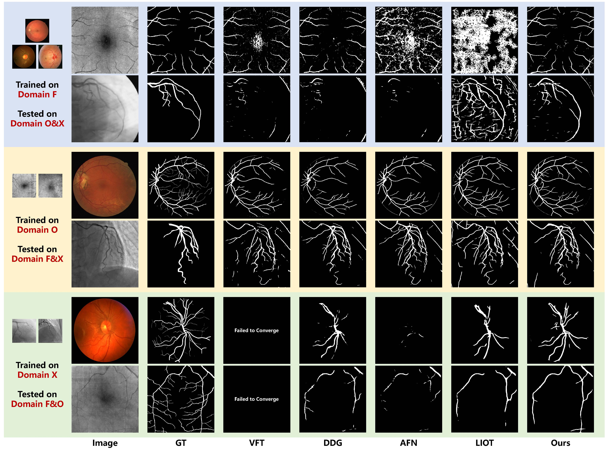

# ISAC: Redefining the Vascular Segmentation Paradigm through Mask Completion for Cross-Domain Generalization

This repository will host the complete implementation of our upcoming MICCAI paper titled **"ISAC: Redefining the Vascular Segmentation Paradigm through Mask Completion for Cross-Domain Generalization"**. The code and associated resources will be made publicly available upon the acceptance of the paper.

The principle of our segmentation approach is illustrated in the figure.

  

